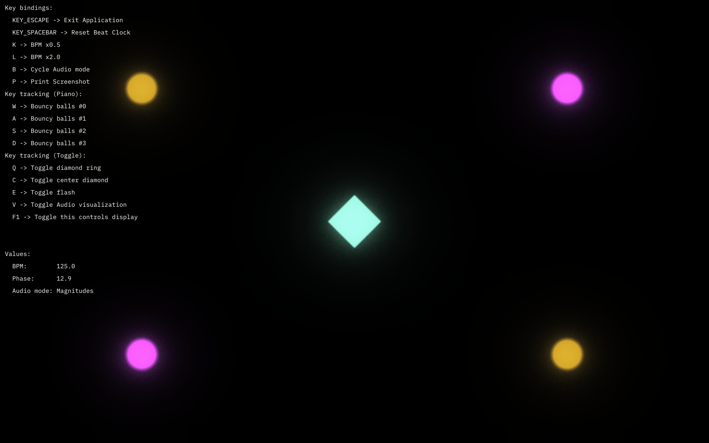
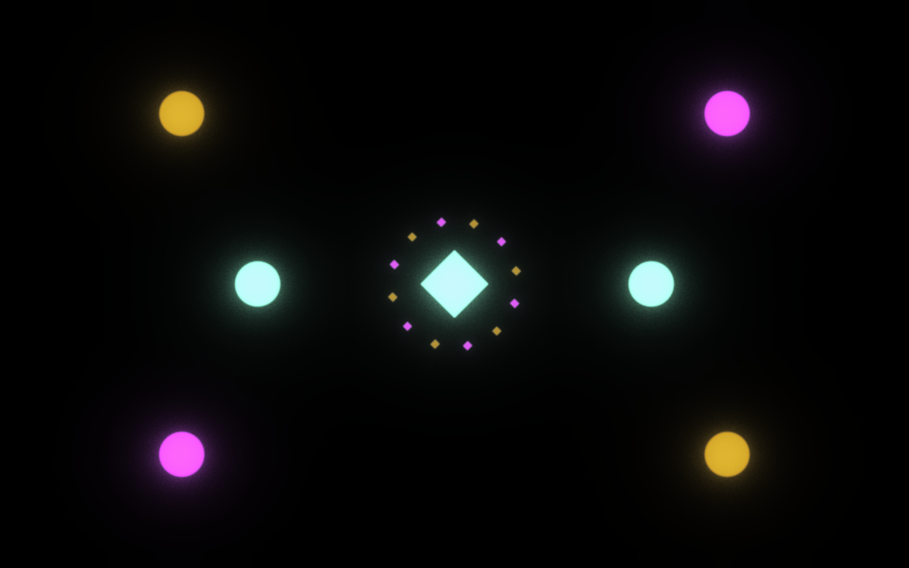
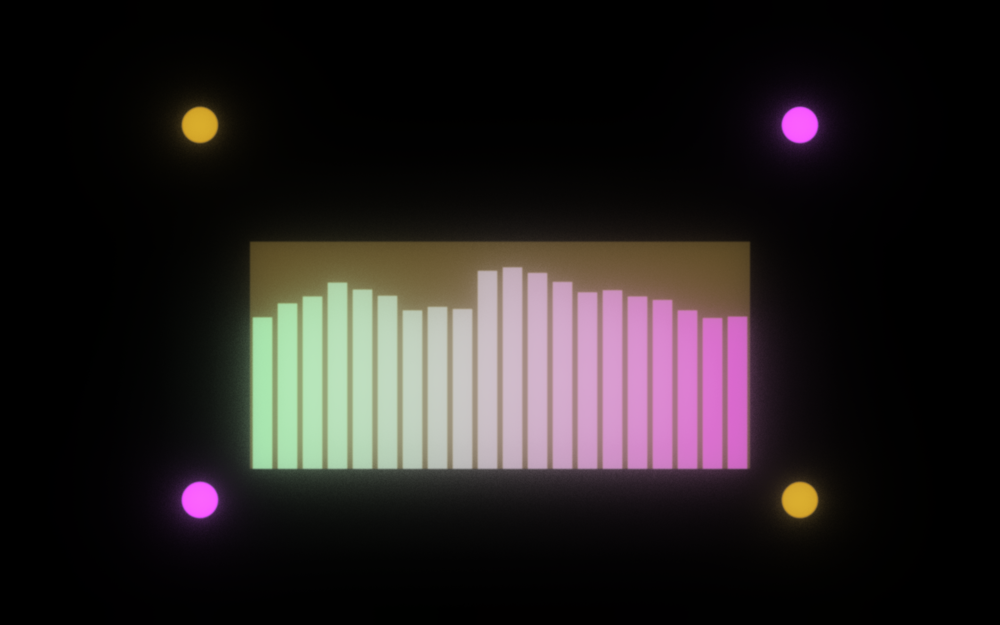

# Flow template

An OPENRNDR template called "Flow" to jumpstart a music visualization program.

Run the template to see the example program in action.

Even better, use the prepared APIs and wire them together as you please.
The result should be stunning visuals - audio reactive and in sync.

___ Forked from https://github.com/openrndr/openrndr-template ___

## Intention

I am Lukas, a VJ and creative coder from Germany.

Many of my VJ projects in OPENRNDR start with similar code snippets, which I used to copy back and forth.
Some parts integrated well, others required extra work.

As the complexity of my projects grew, I wanted to have a more structured approach.
This template is my "expansion" of OPENRNDR that suits my needs for live music visualization.

But I also wanted to share this template, providing the tools and an example to run for everyone.

Feel free to clone and experiment with it, or fork it and make it your own version.

I use this myself as a starting ground for my projects. 
So it is likely, to get support in the foreseeable future. (May, 2023 - ...)

## How to use

### Prerequisites

* [IntelliJ IDEA](https://www.jetbrains.com/idea/download/) (Community or Professional) installed. Other IDEs need to be configured manually.
* Kotlin SDK installed. (Included in IntelliJ IDEA, might need to upgrade to the latest version.)

### Clone And Run

Open IntelliJ IDEA. Navigate to File → New → "Project from Version Control...".

Add this repo's url and clone this repository.

Navigate to `src/main/kotlin/TemplateProgram.kt` and run it. 
(Similar to [OPENRNDR Template](https://github.com/openrndr/openrndr-template))

Press `F1` to toggle the available commands. The other keys are used for the example itself.

### Screenshots

#### TemplateProgram: On Startup

#### TemplateProgram: Diamond ring on, 2 Bouncy balls activated

#### TemplateProgram: Spectral Audio Analysis

### Experiment …

You might notice that this is a GitHub template, not a library.

In the current version, you have the primary logic/ config in a single file.
The APIs are well documented, but are not required to be read through completely.

You can easily change the program to your liking.

To experiment, some starting points might be:
* Setting the bpm to your favorite song's bpm (See: [songbpm.com](https://songbpm.com/))
* Tweaking values
* Changing the color palette
* Write your own visual groups (See: `audioGroup`, `diamondGroup` and `circleGroup`)
* Write your own bpm-based envelopes (See: `kick` and `flash`)

Even better, start from scratch and build something of your own.
Try things out, and enjoy !

## Why should I use this ?

### Based on OPENRNDR

The [OPENRNDR](https://openrndr.org/) framework is powerful and concise out-of-the-box.

Some advantages:
* It is based on [Kotlin](https://kotlinlang.org/).
  One of the [most beloved programming languages](https://survey.stackoverflow.co/2022/#technology-most-loved-dreaded-and-wanted), and my personal favorite.
* Concise access to various computer graphics APIs. Browse (and run) the [examples](https://guide.openrndr.org/) yourself and get your mind blown 🤯
* Extensible. Kotlin allows for some "build your own language" features and OPENRNDR is similar with its APIs. 
  I tend to write the code that I would like to work, and _then_ write the functionality.
* IntelliJ IDEA support. Including the obvious clone-and-run procedure, to code completion.

* Debatable:
* IntelliJ as the supported IDE. I love it, but it's surely not for everyone.
* It is not as popular as other frameworks. 
  This means that fewer libraries are available for it, and more often, you have to write stuff yourself.
  
If you need help on a topic, you might want to visit the [discourse forum](https://openrndr.discourse.group/).

It seems similar to render engines/ frameworks like [Processing.org](https://processing.org/), 
[Three.js](https://threejs.org/)
or even [Skia](https://skia.org/).

After working with many computer graphics tools over the years, I openly admit to love OPENRNDR.

If you are not convinced, I recommend to try it out yourself.

Also, check out the [Doodle Wall](https://openrndr.discourse.group/t/doodles-wall-c) to see what other people made with this amazing framework.

### Made for music visualization 

A fitting description of OPENRNDR is ["a tool to create tools"](https://alternativeto.net/software/openrndr/about/).

I strongly sympathize with that idea:
It allows for many great creative-coding applications, where **you** decide what aspects you want to use.

And this template is a created tool specifically for music visualization. 
It provides APIs and starts with a template program to get you started.

It is not a full-blown VJ software, but a starting point for your own project.

## APIs of the Flow Template

### Beat Clock

Start with `val beatClock = extend(BeatClock(bpm: Int))` and get a beat-tracking extension.

Use its `phase` counting the beats (with decimals) for beat-based effects. 

Bind envelopes via `val cubicInOut by bpm.bindEnvelope { … }` to use a cyclic `Envelope` and
use its value to animate stuff, like size, position, color, etc.

### Audio

Start with `val audio = Audio()`, create audio processor like `VolumeProcessor` or `ConstantQProcessor` via its `audio.create<...>Processor` methods.

Then call `audio.start()` to get the latest audio analysis data from each processor.

Provides common values for working with audio, like the frequency range a human can hear, also called "Acoustic Range": `LOWEST_FQ`/`HIGHEST_FQ`.
Or typical frequency analysis ranges `BASS`, `MID` and `TREBLE`.

### Color Repo

Start with `val colorRepo = colorRepo { … }` and set up your color repository.

Use `palette = listOf( … )` using your favorite color model. 
From `ColorRGBa` to `ColorXSVa` or even `ColorLABa`.

Then use `colorRepo[colorIndex: Int]` to get a color from your palette.

### Visual Groups

Start with `val myVisualGroup = object: VisualGroup { … }` or write your own class, 
to inherit from visual group.

This is the main API to create your own ... well, visual groups.
This allows to organize your components and define an isolated draw procedure for each group.

Implement the `Drawer.draw()` method to draw your visuals.
Then, call `myVisualGroup.draw()`, as well as the other groups' draw function, inside your draw loop.

### Input Scheme

Start with `val inputScheme = inputScheme(myInputDevice: KeyEvents) { … }` and set up your input scheme.

The template uses the default `keyboard` input device, but you can provide your onw device interface.

For the keyboard, keys can always be used by their name, like `'escape'` or `'k'`, 
or by their layout-independent key code, if they have one, like `KEY_ESCAPE` (`'k'` doesn't have one).

Use `inputScheme.keyDown { … }` and specify `String/Int.bind(myDescription) { myAction() }` 
to bind keys to actions.

You can also track keys by different tracking styles: `PIANO` and `TOGGLE`.
Piano tracking treats a key as active as long as it is pressed.
Toggle tracking treats a key as inactive at first, but toggles its active state on every press.

Use their active state anywhere with `inputScheme.isKeyActive(myKey: String/Int)`.

In general, you can unbind/untrack keys and dynamically change key bindings during runtime.

### Graphics pipeline effects (FX)

Start with `val fxRepo = FxRepo { … }` and configure your fx repository.

Provides a setup for the graphics pipeline, similar to vanilla OPENRNDR `compose { … }` blocks.
Those seem to be inefficient, however. So I wrote my own wrapper.

Define your effect `chain` and apply during your procedure. 
Typically at the end, but hey - no on is stopping you to use it in the beginning or the middle. Or multiple times.

## Roadmap

Several APIs are already planned. 
I am happy with the current state of the template, but there is more to come.

Most APIs are subject to change, either by refactoring or by adding new features.

I marked the tasks as done, that are stable and used in the template.

### Template Progress

- [x] Executable Template

### Presented APIs
  - [x] `BeatClock`
  - [x] `Audio`
  - [x] `ColorRepo`
  - [x] `VisualGroup`
  - [x] `InputScheme`
  - [x] `FxRepo`
    - [ ] `MirrorFx` (inspired by Milkdrop → recursive textures). Implemented, but unused.
  - [x] `UiDisplay`
  - [x] `Realtime filters`, currently just OneEuroFilter

### API Progress
- [x] BeatClock
  - [x] Beat tracking
- [ ] Audio API (stable during runtime, but has bug on closing audio stream)
  - [x] Audio dispatch logic
  - [ ] Setup based on system settings/ used processors
    - [ ] Audio device selection
    - [ ] Fixing occasional zombie audio input stream after app exit (killable with force-quit) 
  - [x] General Volume Processor
  - [x] Range-Specific Volume processor (ConstantQ)
  - [ ] Source → Cache/Filter middleware → Value provider (Refactoring)
- [x] Color API
  - [x] Color Repo
  - [x] Color Palette
  - [ ] Color Picker
  - [ ] Callable Procedures, like blend or sampling from a color path
- [x] Content API
  - [x] Visual group for organizing content
  - [x] Inline-object property/function definition and access
- [x] Input Scheme API
  - [x] Input Scheme definition
  - [ ] Common Devices 
    - [x] Keyboard, by name or key code
    - [ ] Mouse
    - [ ] MIDI
    - [ ] Probably some Hardware Abstraction Layer
  - [x] Key tracking
    - [x] PIANO style
    - [x] TOGGLE style
    - [x] track/untrack
  - [x] Key binding
    - [x] bind/unbind
  - [ ] Hard-bound keys (like `f1` for hiding the UI, `escape` for exiting the app)
- [x] FxRepo API
  - [x] Chain definition and usage
  - [ ] Graphics pipeline refactoring (currently quite verbose)
- [x] UiDisplay API
  - [x] Basic UI 
  - [x] Can be hidden
  - [x] Tracking values and displaying them

### Long-Term Goals

* Scenes API
 * Scene management 
 * Scene transitions 
   * Cross-Fading
   * Key Rebinding
* FFMPEG Video API
  * VisualGroup-based Video player
  * Start, Stop, Move to time, etc.
* Param Picker
  * Like `[orx-gui](https://github.com/openrndr/orx/tree/master/orx-jvm/orx-gui)`, but in a different application / interface
  * Live program or similar to change values on the fly (like OliveProgram, but only for hand-picked variables)
* [Spotify API](https://developer.spotify.com/documentation/web-api/reference) integration

